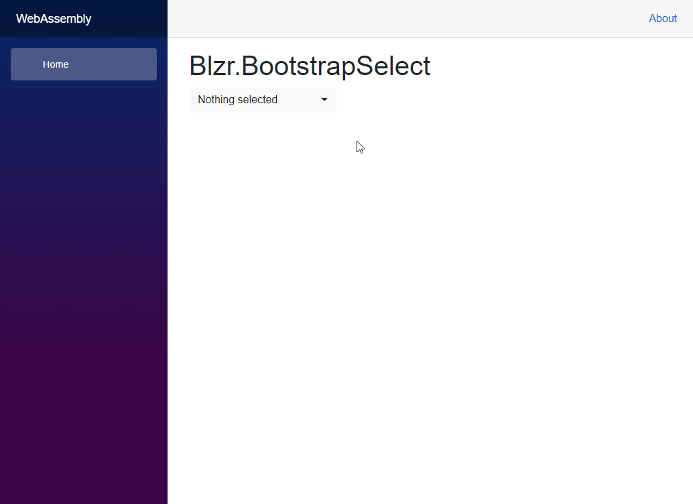

# blzr.bootstrap-select

This [Blazor](https://dotnet.microsoft.com/apps/aspnet/web-apps/blazor) bootstap select component is inspired by the js [bootstrap-select](https://github.com/snapappointments/bootstrap-select/), rewritten using C# as a Razor Component.

There is no dependency with JavaScript.


[](https://github.com/Rob-Newman/blzr.bootstrap-select/actions/workflows/build.yml)

[](https://github.com/rob-newman/blzr.bootstrap-select/actions?query=branch%3Amain++)



To see it in action, visit [https://rob-newman.github.io/blzr.bootstrap-select/](https://rob-newman.github.io/blzr.bootstrap-select/)

## Getting Setup

You can install the package via the NuGet package manager just search for *Blzr.BootstrapSelect*. You can also install via powershell using the following command.

```powershell
Install-Package Blzr.BootstrapSelect
```

Or via the dotnet CLI.

```bash
dotnet add package Blzr.BootstrapSelect
```

### 1. Register Services
You will need to register the Blzr.BootstrapSelect service in your application

#### Blazor WebAssembly
Add the following line to your applications `Program.Main` method.

```csharp
builder.Services.AddBootstrapSelect();
```

#### Blazor Server
Add the following line to your applications `Startup.ConfigureServices` method.

```csharp
services.AddBootstrapSelect();
```

### 2. Add Imports
Add the following to your *_Imports.razor*

```csharp
@using Blzr.BootstrapSelect
```

### 3. Add reference to style sheet(s)
Add the following line to the `head` tag of your `_Host.cshtml` (Blazor Server app) or `index.html` (Blazor WebAssembly).

We ship both minified and unminified CSS.

For minified use:

```HTML
<link href="_content/Blzr.BootstrapSelect/blzr-bootstrap-select.min.css" rel="stylesheet" />
```

For unminified use:
```HTML
<link href="_content/Blzr.BootstrapSelect/blzr-bootstrap-select.css" rel="stylesheet" />
```

Presumably, you already have bootstrap css referenced in your project. If not, use:
```HTML
<link rel="stylesheet" href="https://cdn.jsdelivr.net/npm/bootstrap@4.5.3/dist/css/bootstrap.min.css" integrity="sha384-TX8t27EcRE3e/ihU7zmQxVncDAy5uIKz4rEkgIXeMed4M0jlfIDPvg6uqKI2xXr2" crossorigin="anonymous">
```

## Defaults
The following system wide defaults can be configured as part of the service registration 

- `ShowSearch` (Default: `false`) - Determines if the search box should be displayed. When true, adds a search box to the top of the drop down (works in conjunction with `ShowSearchThreshold`)
- `ShowSearchThreshold` (Default: `0`) - The threshold to determine the number of options that must exists before the search box is displayed
- `SearchPlaceholderText` (Default: `"Search"`) - The placeholder text displayed in the search box 
- `SearchNotFoundText` (Default: `"No matching results"`) - The text displayed if no options match a search term
- `DelayValueChangedCallUntilClose` (Default: `false`) - For multi's only, whether to delay calling ValueChanged until after the select is closed (default will fire after each option is selected/deselected)
- `SelectedTextFormat` (Default: `SelectedTextFormats.Values`) - Specifies how the selection is displayed with a multi select. `Values` displays a list of the selected options (separated by `MultiSeparator`). `Static` simply displays the select element's placeholder text. `Count` displays the total number of selected options.  `CountGreaterThan` behaves like `Values` until the number of selected options is greater than `SelectedTextFormatCount` where it then behaves like `Count`
- `SelectedTextFormatCount` (Default: `0`) - If `SelectedTextFormat` is `CountGreaterThan`, ths is the number of options that must be selected for the `Count` format to be applied
- `MultiSelectedText` (Default: `"{0} of {1} selected"`) - Specifies the text to display when the `SelectedTextFormat` is `count`. `{0}` is replaced with the number of selected items. `{1}` is replaced with the total number of options  
- `MultiSeparator` (Default: `", "`) - The separator used for multi selected text when the format is `Values`
- `ShowPlaceholder` (Default: `false`) - For singles only, determines if the placeholder text should be displayed
- `MultiPlaceholderText` (Default: `"Nothing selected"`) - The text to display as the placeholder for multi's
- `SinglePlaceholderText` (Default: `"Select..."`) - The text to display as the placeholder for singles
- `ShowTick` (Default: `false`) - Whether to show the checkmark on singles 
- `MaxSelectionsText` (Default: `"Limit reached ({0} items max)"`) - The text to display if the max number of selections is met. `{0}` is replaced with the `MaxSelections` parameter
- `SearchStyle` (Default: `SearchStyles.Contains`) - When set to `SearchStyles.Contains`, searching will reveal options that contain the searched text.  When set to `SearchStyles.StartsWith`, searching will reveal options that start with the searched text
- `ShowActions` (Default: `false`) - For multi's only. When set, adds two buttons to the top of the dropdown menu (Select All and Deselect All)
- `SelectAllText` (Default: `"Select All"`) - The text to display on the select all button 
- `DeselectAllText` (Default: `"Deselect All"`) - The text to display on the deselect all button 
- `ButtonStyle` (Default: `ButtonStyles.Default`) - The button class to use to style the select button

### Example
```csharp
builder.Services.AddBootstrapSelect(defaults =>
                {
                    defaults.ShowSearch = true;
                    defaults.SearchPlaceholderText = "Find";
                    defaults.ShowSearchThreshold = 10;
                    defaults.SearchNotFoundText = "Can't find any";
                    defaults.DelayValueChangedCallUntilClose = true;
                    defaults.SelectedTextFormat = SelectedTextFormats.CountGreaterThan;
                    defaults.SelectedTextFormatCount = 2;
                    defaults.MultiSelectedText = "{0} selected";
                    defaults.MultiSeparator = "|";
                    defaults.ShowPlaceholder = true;
                    defaults.MultiPlaceholderText = "Pick some";
                    defaults.SinglePlaceholderText = "Pick one";
                    defaults.ShowTick = true;
                    defaults.MaxSelectionsText = "Too Many ({0} is max!)";
                    defaults.SearchStyle = SearchStyles.StartsWith;
                    defaults.ShowActions = true;
                    defaults.SelectAllText = "All of them";
                    defaults.DeselectAllText = "None of them";
                    defaults.ButtonStyle = ButtonStyles.Success;
                });
```

## Usage

### Basic Example
```csharp
@page "/"

<BootstrapSelect TItem="Country" Data="@countries" TextField="@((item) => item.Name)" 
                 ValueField="@((item) => item.Id.ToString())" TType="string" />

@code {
    private IList<Country> countries;

    protected override void OnInitialized()
    {
        countries = new List<Country> {
            new Country { Id = 1, Name = "United Kingdom" },
            new Country { Id = 2, Name = "United States" },
            new Country { Id = 3, Name = "Germany" },
            new Country { Id = 4, Name = "France" },
            new Country { Id = 5, Name = "China" }
        };
    }

    public class Country
    {
        public int Id { get; set; }

        public string Name { get; set; }
    }
}
```
### Parameters

- `TItem` (Required) - The underlying type of the objects used in the Data collection
- `TType` (Required) - The underlying type of the Value field.  Currently supported is: `string`, `int`, `IEnumerable<string>`, `IEnumerable<int>`
- `Data` (Required) - The Data to use to build the drop down options from
- `TextField` (Required) - The `Func` to select the Text value from each item within `Data`
- `ValueField` (Required) - The `Func` to select the Value value from each item within `Data`
- `OptGroupField` (Optional) - The `Func` to select the Opt Group value from each item within `Data`. If this is supplied, opt groups will be displayed, and its assumed that the `Data` will be sorted so that all items from the same opt group are positioned together  
- `KeyWordsField` (Optional) - The `Func` to select the Key Words list from each item within `Data`. If this is supplied, the key words will be included when performing serching
- `Id` (Optional) - Html Id to be added to the element
- `Value` (Optional) - An initial value for the select.  Can be used for 2 way binding using `@bind-value`
- `ValueChanged` (Optional) - An `EventCallback` to be called when the value changes 
- `IsMultiple` (Optional. Default `false`) - Determines if the select should be a single or multi
- `ShowSearch` (Optional. Default: Uses system wide Defaults) - Determines if the search box should be displayed. When true, adds a search box to the top of the drop down (works in conjunction with `ShowSearchThreshold`)
- `ShowSearchThreshold` (Optional. Default: Uses system wide Defaults) - The threshold to determine the number of options that must exists before the search box is displayed
- `DelayValueChangedCallUntilClose` (Optional. Default: Uses system wide Defaults) - For multi's only, whether to delay calling ValueChanged until after the select is closed (default will fire after each option is selected/deselected)
- `SelectedTextFormat` (Optional. Default: Uses system wide Defaults) - Specifies how the selection is displayed with a multi select. `Values` displays a list of the selected options (separated by a ,). `Static` simply displays the select element's placeholder text. `Count` displays the total number of selected options.  `CountGreaterThan` behaves like `Values` until the number of selected options is greater than `SelectedTextFormatCount`
- `SelectedTextFormatCount` (Optional. Default: Uses system wide Defaults) - If `SelectedTextFormat` is `CountGreaterThan`, ths is the number if options that must be selected until the message is displayed
- `ShowPlaceholder` (Optional. Default: Uses system wide Defaults) - For singles only, determines if the placeholder text should be displayed
- `PlaceholderText` (Optional. Default: Uses system wide Defaults) - The placeholder text
- `Width` (Optional) - If supplied, will be used to add a width to the element
- `CssClass` (Optional) - Additional classes to be added to the element
- `Label` (Optional) - A label to added to the element
- `ValidationFor` (Optional) - A `Expression` to provide the validation information. Can only be used if component is within an `EditForm`
- `ShowTick` (Optional. Default: Uses system wide Defaults) - Whether to show the checkmark on singles 
- `MaxSelections` (Optional) - For multi's only, if supplied, limit the number of options that can be selected
- `SearchStyle` (Optional. Default: Uses system wide Defaults) - When set to `SearchStyles.Contains`, searching will reveal options that contain the searched text.  When set to `SearchStyles.StartsWith`, searching will reveal options that start with the searched text
- `ShowActions` (Optional. Default: Uses system wide Defaults) - For multi's only. When set, adds two buttons to the top of the dropdown menu (Select All and Deselect All)
- `ButtonStyle` (Optional. Default: Uses system wide Defaults) - The button class to use to style the select button

See the code in the index page within samples for more examples

## Preview builds and NuGet feed

All official release packages are published to the official and public NuGet feed.

Preview builds (builds from the `main` branch) produce unofficial pre-release packages which can be pulled from the [project's NuGet feed on GitHub](https://github.com/Rob-Newman?tab=packages&repo_name=blzr.bootstrap-select).

These packages are being tagged with the Workflow's run number as the package version.

All other builds, such as builds triggered by pull requests produce a NuGet package which can be downloaded as an artifact from the individual GitHub action.

## Contributing

Everyone is welcome to contribute to Blzr.BootstrapSelect. Please take a moment to review the [contributing guidelines](CONTRIBUTING.md).

## License

Licensed under the MIT license.
